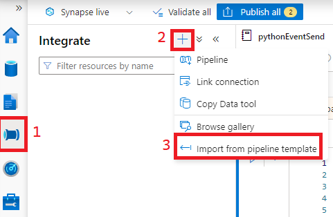
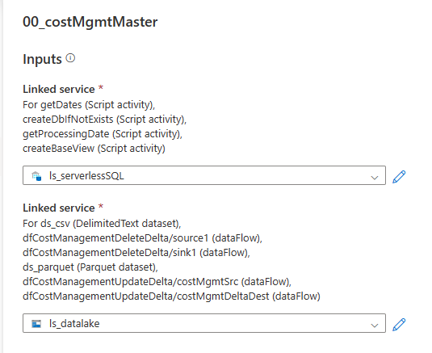

#### Add Pipelines from the included template
1) In Synape Studio, import a pipeline by following the steps below.
    
    
    
2) Select the [00_costMgmtMaster](../pipelines/00_costMgmtMaster.zip) file from this repository.
3) When prompted to choose a Linked Services service select the choices as shown below. 
   
   

4) Click the Publish All button to deploy the Pipelines and make them available to Trigger. 
   
    