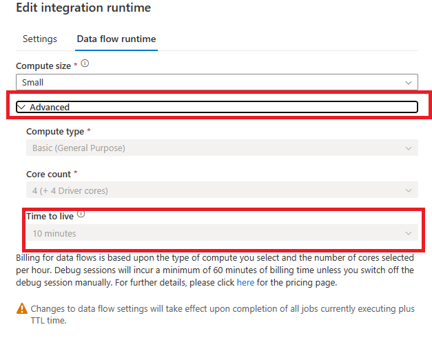
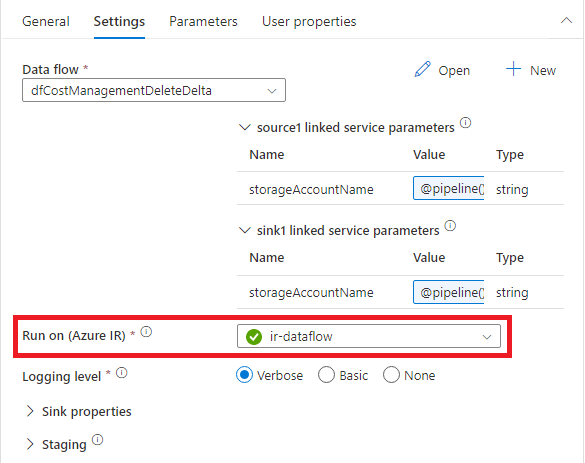

## Create an Azure Integration Runtime to support Data Flows
1) Follow steps 1-4 in [this guide](https://learn.microsoft.com/en-us/azure/data-factory/create-azure-integration-runtime?source=recommendations&tabs=synapse-analytics#create-an-azure-ir-via-ui) and proceed with the steps below.
2)  Name your Integration Runtime something that indicates it is for use with Data Flows. 
3)  Make sure the Region is set to Auto Resolve.
4)  Click on the Data Flow runtime tab to adjust compute accordingly but more importantly set Time to Live to allow the cluster to stay warm through subsequent runs of the Data Flows. More information on this [here](https://learn.microsoft.com/en-us/azure/data-factory/concepts-integration-runtime-performance#time-to-live).
   
    

5) Click Create to finish the Integration Runtime creation.
6) Open up the 03_costMgmtLoadMonthData Pipeline.
7) Find the deleteDelta and loadDelta Data Flow Activities and change their settings to use the Integration Runtime just created for Data Flows.

    

