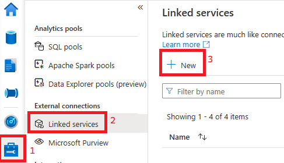
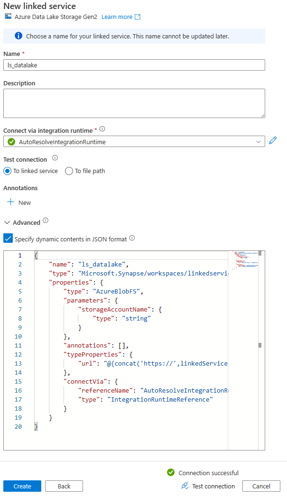

## Add Linked Services to Synapse Workspace

1) Open you Synapse Workspace by going to [web.azuresynapse.net](https://web.azuresynapse.net).
2) Follow the navigation path below to create a new Linked Service

    

3) Search for "Azure Data Lake Gen 2" and click Continue.
4) In the subsequent screen, name the Linked Service ls_datalake, tick the box in Advanced that says "Specify dynamic contents in JSON format", and paste the contents of the [ls_datalake.json](../linkedServices/ls_datalake.json) file. Example setup shown below.

    

5) Test the connection and put the source or destination storage account when prompted. 
6) If everything is successful click complete. 
7) Repeat the process outlined in steps 1-6 but choose a Azure Synapse Analytics Linked Service and copy the contents of [ls_serverlessSQL](../linkedServices/ls_serverlessSQL.json) into the "Specify dynamic contents in JSON format" field.