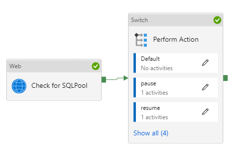
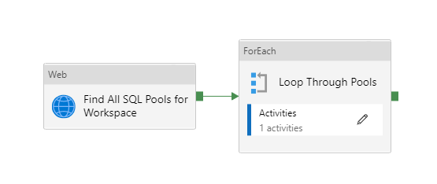
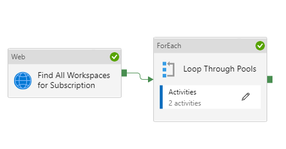

## Pause Scale Resume Synapse Dedicated SQL Pool

The pl_pauseScaleResume pipeline can be used to manage Synapse Analytics Dedicated SQL Pools. All necessary paramaters are included to perform this process. The only pre-requisite is ensuring the Managed Identity for your Synapse Workspace has Contributor access to the Dedicated SQL Pool.

## Optional Pipeline - Resume/Pause all Dedicated SQL Pools in Workspace

The pl_pauseScaleResume_Workspace takes the Action set in parameters on all Dedicated SQL pools in your Synapse Workspace. 

## Optional Pipelne -Resume/Pause all Dedicated SQL Pools in Subscription

The pl_pauseScaleResume_Workspace takes the Action set in parameters on all Dedicated SQL pools in the Subscription noted in the Parameters. 

## Parameters
 - Action - Action you are wanting to take against the dedicated pool. Accepts the values of pause, resume, or scale.
    - Used in all pipelines
 - ActionScale - Only used when the Action parameter is set to scale. Accepts values from DW100c to DW30000c
    - Used in all pipelines
 - SubscriptionId - SubscriptionId where the Synapse workspace resides.
    - Used in all pipelines
 - ResourceGroup - Resource group where the Synapse workspace resides.
    - Only needed in pl_pauseScaleResume_Workspace and pl_pauseScaleResume
 - SynapseWorkspace - Name of the Synapse Workspace the dedicated pool resides in.
    - Only needed in pl_pauseScaleResume_Workspace and pl_pauseScaleResume
 - SqlPool - Name of the Dedicated Pool to pause, resume, or scale.
    - Only needed in pl_pauseScaleResume
 - EmptyBodyForPost - This is meant to get around Synapse Pipelines requirements for a body on POST and PUT methods. The only value it should be set to is {} as the REST API for Pausing/Resuming does not require a body.

## Importing to Synapse.
In Synapse Pipelines, import the zip in this repo. _(more to come here)_