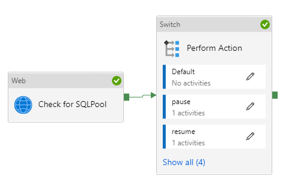

## Pause Scale Resume Synapse Dedicated SQL Pool
This pipeline can be used to scale Synapse Analytics Dedicated SQL Pools. All necessary paramaters are included to perform this process. The only pre-requisite is ensuring the Managed Identity for your Synapse Workspace has Contributor access to the Dedicated SQL Pool.

## Parameters
 - Action - Action you are wanting to take against the dedicated pool. Accepts the values of pause, resume, or scale.
 - ActionScale - Only used when the Action parameter is set to scale. Accepts values from DW100c to DW30000c
 - SubscriptionId - SubscriptionId where the Synapse workspace resides.
 - ResourceGroup - Resource group where the Synapse workspace resides.
 - SynapseWorkspace - Name of the Synapse Workspace the dedicated pool resides in.
 - SqlPool - Name of the Dedicated Pool to pause, resume, or scale.
 - Region - Only used with the Action parameter is set to scale.The Azure region the SqlPool parameter resides in. 

## Importing to Synapse.
In Synapse Pipelines, import the zip in this repo. _(more to come here)_
