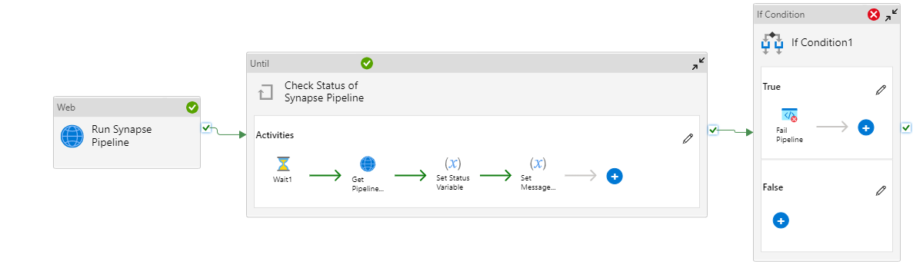
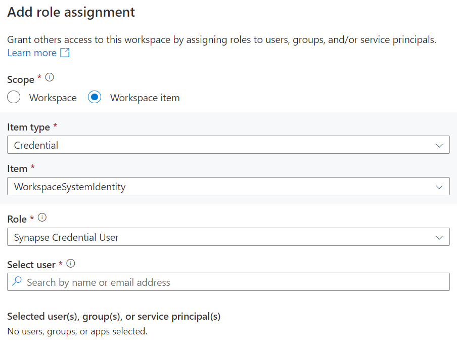
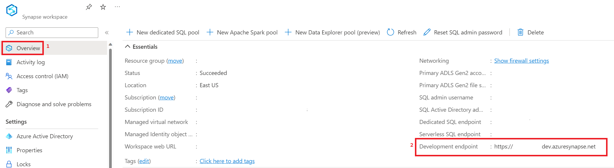
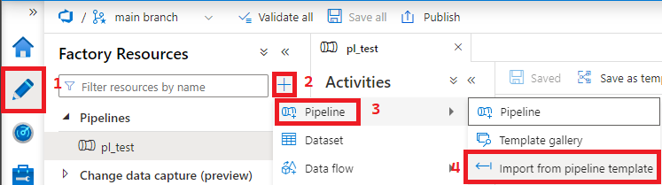

## Run Synapse Pipeline from Azure Data Factory (or other Synapse Workspace)

This pipeline allows you to call a Synapse pipeline through the REST API in the event you would like to orchestrate a pipeline run in Azure Data Factory or a different Synapse workspace. It uses the [Create Pipeline Run](https://learn.microsoft.com/en-us/rest/api/synapse/data-plane/pipeline/create-pipeline-run?tabs=HTTP) and [Get Pipeline Run](https://learn.microsoft.com/en-us/rest/api/synapse/data-plane/pipeline-run/get-pipeline-run?tabs=HTTP) endpoints to execute the pipline and check the execution continuously for a status change from InProgress. If the pipeline receives a Failure status back from the the Get Pipeline Run endpoint, it will fail the pipeline and record the Error Message. When nesting this pipeline, you'll be able to follow a failure path to create error handling. 

## Pre-Requisites

The Managed Identity(MSI) representing your Azure Data Factory will minimally need 3 Synapse-specific RBAC permissions to execute. To review pipeline runs and monitor status your ADF MSI will need the __Synapse Monitoring Operator__ permission. To execute pipelines your ADF MSI will need __Synapse User__ and __Synapse Credential User__ permissions. The Synapse Credential User will need to be scoped to the WorkspaceSystemIdentity as shown in the photo below. More information on these RBAC requirements [here](https://learn.microsoft.com/en-us/azure/synapse-analytics/security/synapse-workspace-understand-what-role-you-need#tasks-and-required-roles).

## Parameters
The pipeline accepts 3 parameters. Explanations of those below.

- __synapseWorkspaceDevEndpoint__ - This can be retrieved by looking in the Overview pane in Azure Portal. It will typically follow the convention of https://yourworkspacename.dev.azuresynapse.net.

    

- __synapsePipelineName__ - This is the name of the pipeline you want to execute in Synapse. 
- __synapsePipeParameterBody__ - As shown [here](https://learn.microsoft.com/en-us/rest/api/synapse/data-plane/pipeline/create-pipeline-run?tabs=HTTP#request-body), if your Synapse pipeline accepts parameters you can set them in the body of the request being sent by the Azure Data Factory Web Activity. If you do not have parameters, it is best to just send an empty body by sending opening and closing curly braces in this parameter.

## Importing to ADF.
Take the [pl_runSynapsePipeline.zip](./pl_runSynapsePipeline/pl_runSynapsePipeline.zip) from this repo and import it into Data Factory following the below steps.

